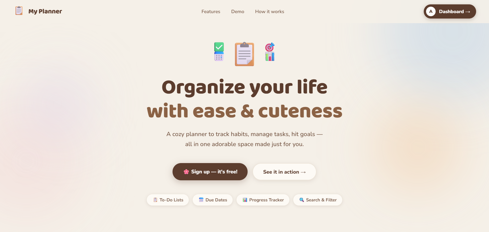
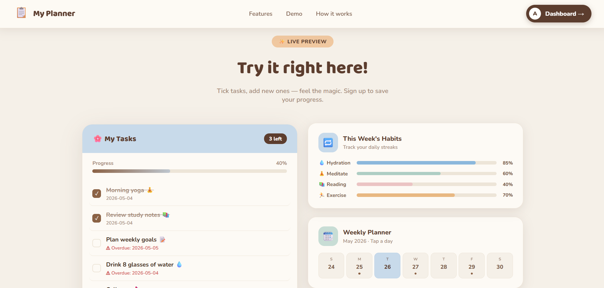
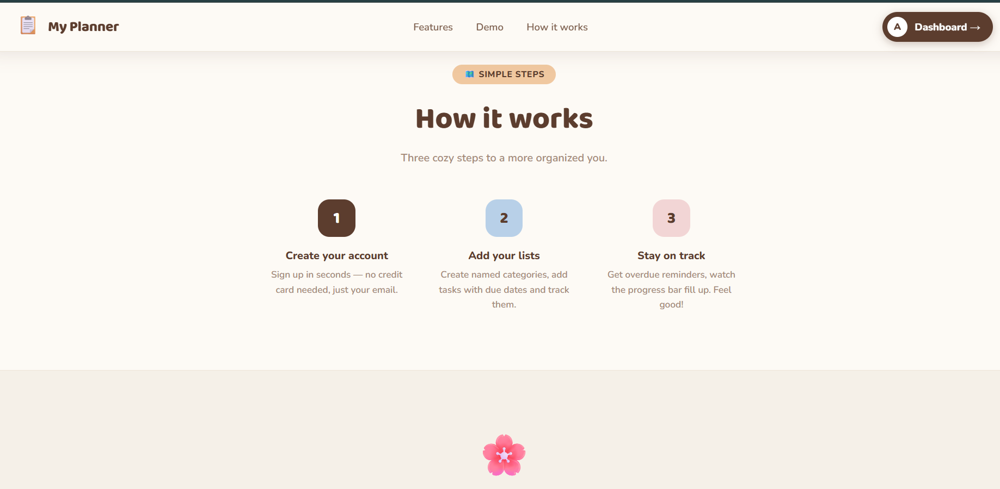
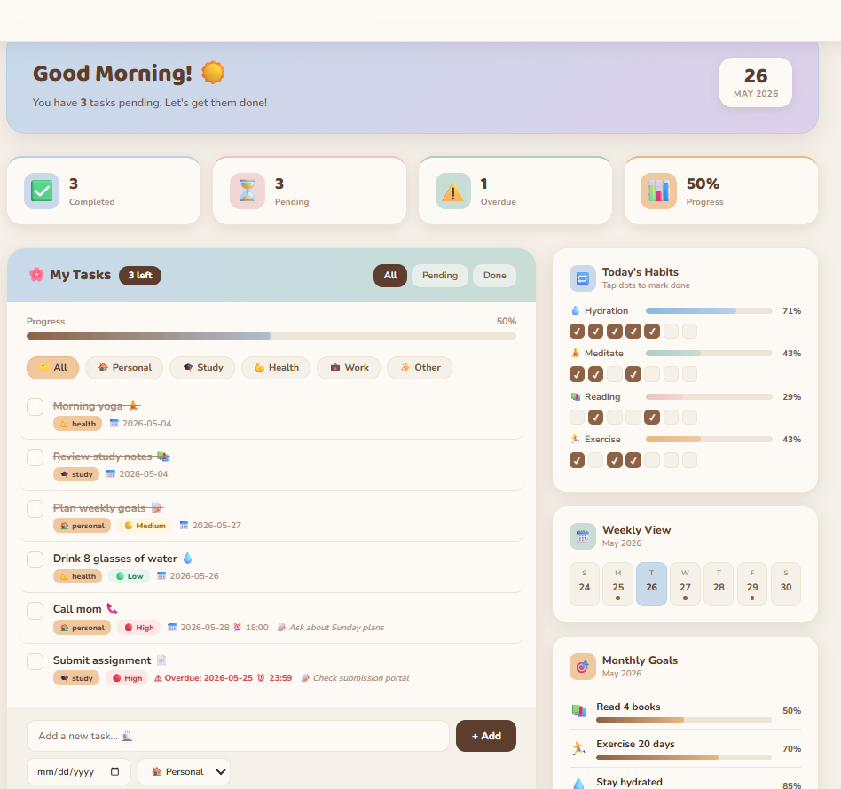
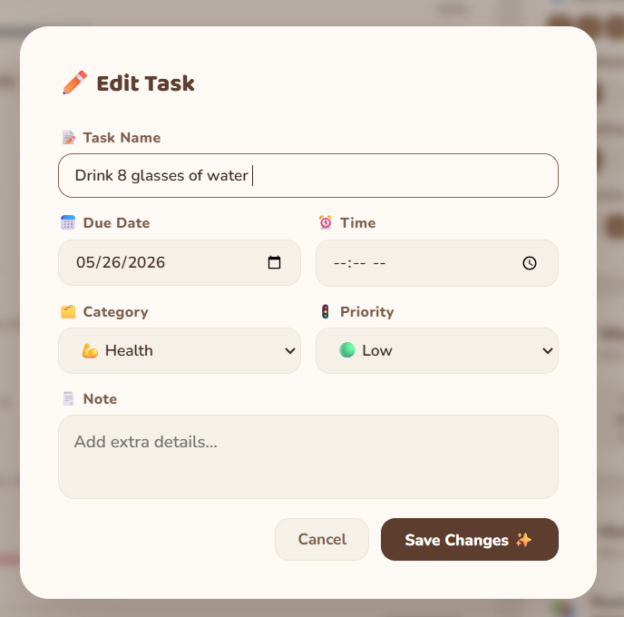
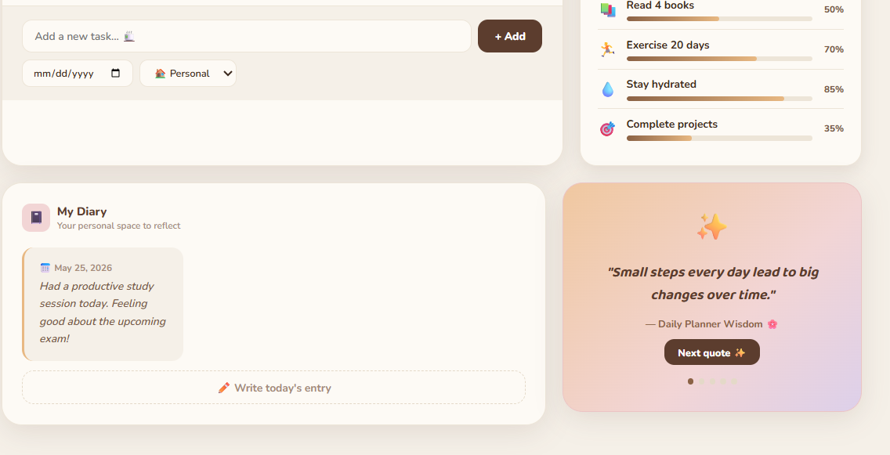

# SCT_WD_4 - Personal Planner & To-Do Application

A feature-rich personal planner web application built during my Web Development Internship at SkillCraft Technology. More than just a to-do app — it's a complete productivity space designed to help users organize their life with ease.

# Task Description
Develop a to-do application that enables users to:
- Add and maintain tasks
- Organize items in lists
- Mark tasks as completed
- Edit tasks
- Set date & time for tasks

# Technologies Used
- HTML5
- CSS3
- JavaScript (Vanilla)

# Features
- Add, edit and delete tasks
- Organize tasks by categories — Personal, Study, Health, Work
- Set priority levels — High, Medium, Low
- Set due date and time for tasks
- Mark tasks as completed
- Filter tasks — All, Pending, Done
- Progress tracker
- Habit Tracker with daily streaks
- Weekly Planner view
- Monthly Goals tracker
- My Diary — daily reflections
- Motivational quotes
- Fully responsive design

# Project Structure
SCT_WD_4/
├── index.html      → Landing page
├── dashboard.html  → Main planner dashboard
├── script.js       → Core logic
├── style.css       → Styles
└── README.md

# Live Demo
[My Planner](https://varinda-aggarwal.github.io/SCT_WD_4/)

# Screenshots

## Home Page

## Demo Section

## How It Works

## Dashboard

## Edit Task

## Personal Diary

## Author
**Varinda Aggarwal**

Web Development Intern @SkillCraft Technology

# Connect
- GitHub: [@varinda-Aggarwal](https://github.com/varinda-Aggarwal)
- LinkedIn: [Varinda Aggarwal](https://www.linkedin.com/in/varinda-aggarwal-537101308)
